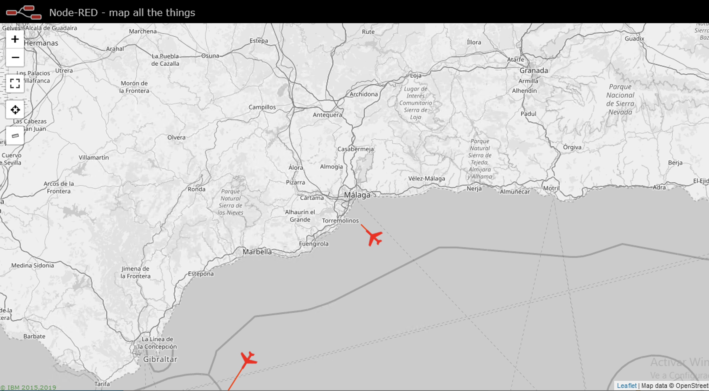
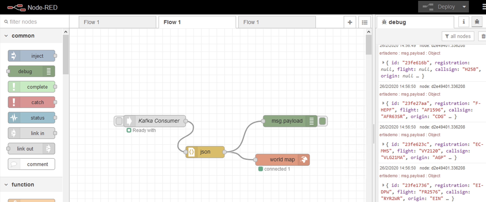

# Flight visualization in Node-RED with worldmap through Apache Kafka

This project displays the flight routes within latitude and longitude from FlightRadar24 in a Node-RED worldmap. The information is obtained and sent through Apache Kafka to Node-RED. All the components are deployed in Docker containers through Docker Swarm.



This project requires a Docker Swarm cluster to deploy the components. Plese visit the [official page](https://docs.docker.com/engine/swarm/) for more information. 


## 1. Deploy the stack in Docker Swarm
The latitude, longitude, refresh time, radious and other parameters can be configured in the environment variables of the flightradar24_to_kafka service in the `docker-compose.yml` file.

Clone this repository in a manager of your Docker Swarm cluster and deploy the stack:
```
docker stack deploy -c docker-compose.yml flightdemo
```

## 2. Install the Node-RED nodes
Once deployed the containers, the following nodes have to be added to the Node-red palette (Settings->Manage palette->Install):

```
node-red-contrib-kafka-manager
node-red-contrib-web-worldmap
```

The Node-RED flow consists in four components: a Kafka consumer to recibe the flight information; a JSON function to parse the string received; a debug funcion; and the worldmap node to visualize the flights in worldmap.




## 3. Import the flow in Node-RED

Please import the following flow to add the Node-RED nodes:

```
[{"id":"f02fbbbf.976788","type":"tab","label":"Flow 1","disabled":false,"info":""},{"id":"9387bcc2.169d9","type":"worldmap","z":"f02fbbbf.976788","name":"","lat":"36.72016","lon":"-4.42034","zoom":"","layer":"","cluster":"","maxage":"10","usermenu":"show","layers":"show","panit":"false","hiderightclick":"false","coords":"none","path":"","x":550,"y":340,"wires":[]},{"id":"82e07541.c190f","type":"Kafka Consumer","z":"f02fbbbf.976788","name":"","broker":"201e15f6.763c0a","topics":[{"topic":"ertisdemo","offset":0,"partition":0}],"groupId":"kafka-node-group","autoCommit":"true","autoCommitIntervalMs":5000,"fetchMaxWaitMs":100,"fetchMinBytes":1,"fetchMaxBytes":1048576,"fromOffset":0,"encoding":"utf8","keyEncoding":"utf8","connectionType":"Consumer","x":220,"y":240,"wires":[["54bffe21.31226"]]},{"id":"54bffe21.31226","type":"json","z":"f02fbbbf.976788","name":"","property":"payload","action":"obj","pretty":false,"x":350,"y":320,"wires":[["9387bcc2.169d9","d2e49401.336208"]]},{"id":"d2e49401.336208","type":"debug","z":"f02fbbbf.976788","name":"","active":true,"tosidebar":true,"console":false,"tostatus":false,"complete":"false","x":570,"y":240,"wires":[]},{"id":"201e15f6.763c0a","type":"Kafka Broker","z":"","name":"","hosts":[{"host":"kafka","port":9092}],"connectTimeout":"10000","requestTimeout":"30000","autoConnect":"true","idleConnection":"5","reconnectOnIdle":"true","maxAsyncRequests":"10","checkInterval":"10","usetls":false}]
```

## 4. Show the flight routes in worldmap

Finally, the flight routes will be displayed in http://yourNodeREDIP:1880/worldmap

